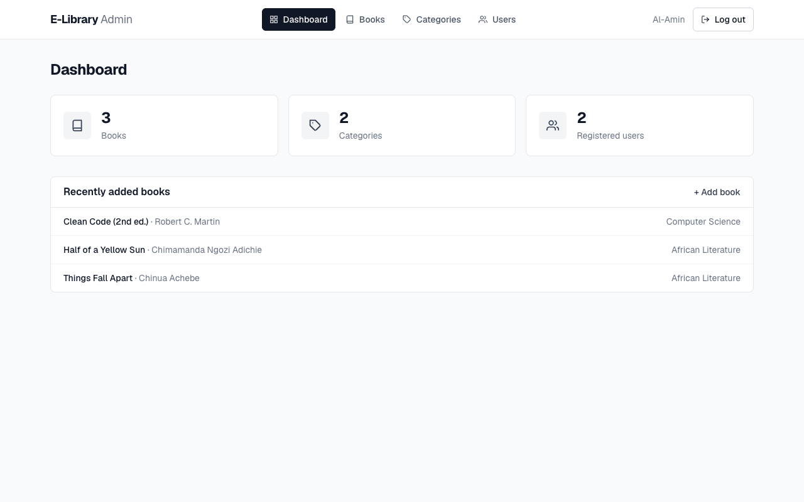
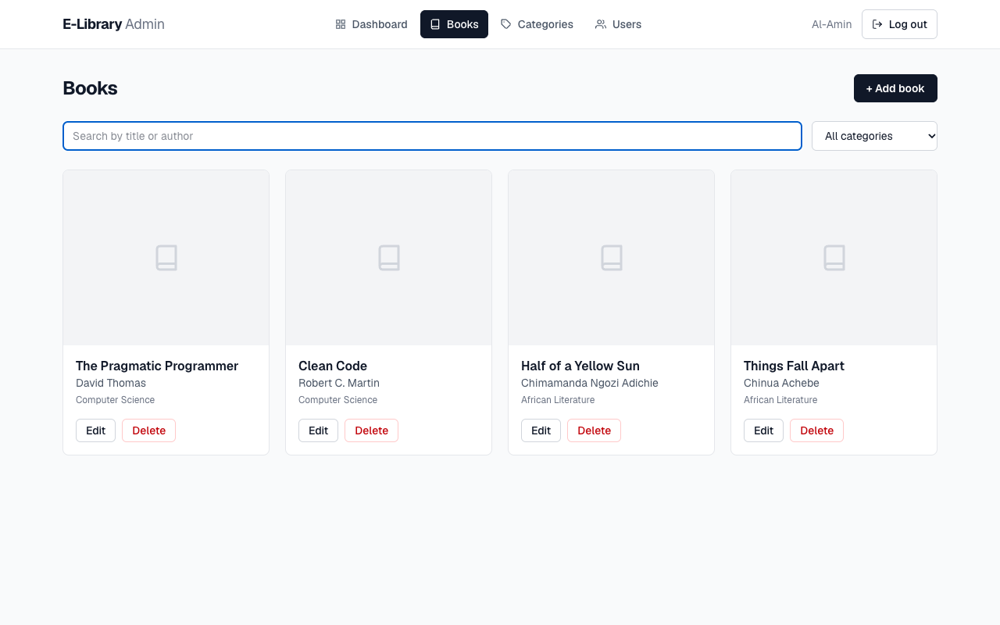
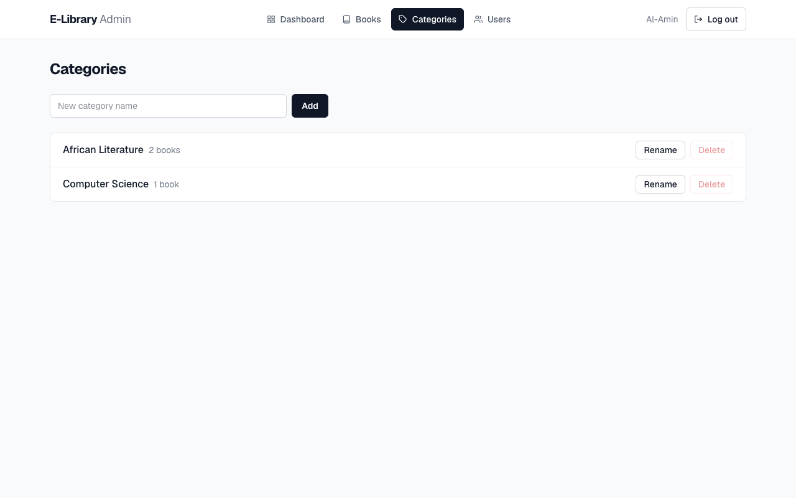
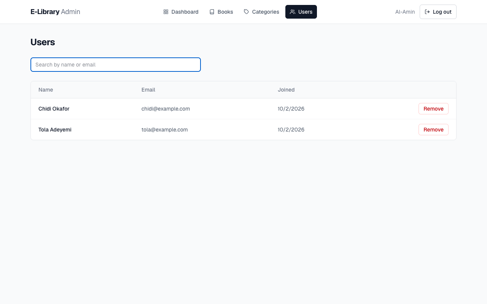

# E-Library Admin Dashboard

[](https://github.com/agent-mino/e-library-admin/actions/workflows/ci.yml)

Admin dashboard for an e-library, built with **Next.js 15 (App Router), React 19, TypeScript and Tailwind CSS v4**.
Admins sign in and manage the library's books, categories and registered readers through the
[E-Library API](https://github.com/agent-mino/e-library-server) (FastAPI + MongoDB).

> **Group project.** I built this admin dashboard; the API was written with teammates.



## Features

- **Sign-in with JWT.** The token is attached to every API request. Each page confirms the session with
  `/admin/me`, and an expired session signs the admin out with a message.
- **Dashboard** with live counts of books, categories and users, plus the latest additions.
- **Books:** search by title or author (debounced, server-side), filter by category, add and edit through one
  shared form, and delete with confirmation.
- **Categories:** create, rename inline and delete. Delete is disabled while a category still has books, and
  the API enforces the same rule.
- **Users:** searchable table of registered readers with removal.
- **Readable errors.** API validation errors (FastAPI `detail`) are shown in plain language, and an unreachable
  API gets its own message.

| Books | Categories | Users |
|---|---|---|
|  |  |  |

## How it's organised

```
admin-frontend/
  app/                 routes: login (/), dashboard, books (+ new, [id]/edit), categories, users
  components/
    AdminShell.tsx     auth guard + navigation shared by every signed-in page
    BookForm.tsx       add/edit form used by both book routes
    Notice.tsx         error, loading and empty states
  lib/
    api.ts             fetch wrapper: base URL from env, Bearer token, error messages, 401 handling
    auth.ts            session storage helpers
    types.ts           types matching the API's response models
```

## Run locally

Start the [API](https://github.com/agent-mino/e-library-server#run-locally) first (it runs on port 8000 by
default), then:

```bash
cd admin-frontend
npm install
cp .env.example .env.local     # NEXT_PUBLIC_API_BASE=http://127.0.0.1:8000
npm run dev                    # http://localhost:3000
```

The first admin account is created through the API (`POST /admin/signup`); after that, only admins can add
admins.

## Scripts

```bash
npm run dev     # development server
npm run lint    # ESLint
npm run build   # production build
```

CI runs lint and a production build on every push.
